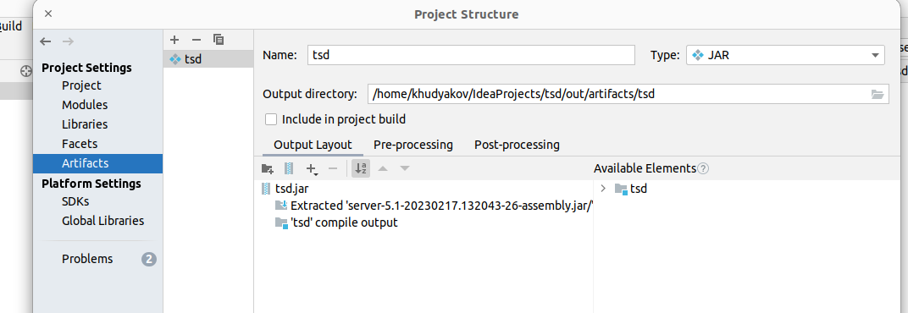

# [LsFusion](https://lsfusion.org/) на андроиде #

 Обнаружив для android эмуляцию среды Linux [Termux](https://termux.dev/en/) сразу посмотрел что можно установить. Из коробки поставилась Java (openjdk-17) и postgreSQL. Попробовал запустить и проверить работу сервера [LsFusion](https://lsfusion.org/). Заработал и сервер и Tomcat c web клиентом LsFusion. Дальше попробовал что-нибудь полезное.
В конфигурации присутствуют примеры соединения LsFusion между собой и 1с по интерфейсу ODATA как на чтение, так и на запись.

## 1. Сбор данных по штрих кодам ##
На предприятиях часто необходимо использовать программно-аппаратное обеспечение для сбора данных о движениях материалов/продукции по цехам или участкам. До этого делал форму для фиксации штрих кода корзин с продукцией при входе или выходе с участка, но это были фиксированные планшеты с проводными сканерами штрих кода которые постоянно в сети предприятия и приложение работает с сервера. Ограничение мобильных терминалов в том, что связь есть не всегда. При приемлемой скорости работы приложения LsFusion можно попробовать использовать локальный сервер LsFusion прямо в андроиде без написания приложения под андроид. Плюс один - программа на одном языке и одной платформе.

### 1.1 Задача ###
Есть терминал на андроиде Honeywell EDA50K имеющий аппаратный сканер штрих кода. Первым подходом нужно: 
1. организовать сканирование паллет выходящих из производства для последующего формирования документа выпуска.
1. работа на тсд должна онлаин (насколько позволяет связь) быть видна на центральной базе.

 ### 1.2 Реализация ###
**Центральная БД** - имею ввиду сервер LsFusion с установленным web-клиентом. Т.е. независимая программа и база данных LsFusion.
**Мобильная БД**  - **ТОЖЕ** имею ввиду сервер LsFusion с установленным web-клиентом. Т.е. независимая программа и база данных LsFusion.

Они имеют одинаковую конфигурацию описанную ниже. Обмен между ними идет по http протоколам. 
К каждой можно подключатся отдельно. Плюс мобильной - она стоит на терминале и работает независимо от наличия сетевого подключения.

**Учетная система** - в  настоящем примере 1с 

 
 Создадим единую конфигурацию для клиента и сервера чтобы файл обновления был один. Примерный состав приложения будет следующим:


Меню для администратора будет выглядеть так


#### 1.2.1 ФОРМА НАСТРОЕК ПРИЛОЖЕНИЯ #### 

В модуле `TsdVars` объявим переменные режима базы данных и логины пароли подключения.
В модуле `TsdConfig` создадим форму и подключим в интерфейс (NAVIGATOR). 
В зависимости от флажка главной базы будут видны строки подключения к 1с или к главной базе


#### 1.2.2 СПИСКИ #### 
 Для ведения справочников нужно решить несколько задач. Чтобы не дублировать код воспользуемся механизмом `META`
и основной код положим в модуль `TsdCatalog`.
На примере модуля `TsdNomenkl`
1. создания списка `CLASS TsdNomenkl 'Номенклатура' ... `
2. формы списка `FORM formTsdNomenkl 'Номенклатура' ...`
3. формы импорта из json `FORM formImportTsdNomenkl 'Номенклатура' ...`
4. процедуры импорта и синхронизации `syncTsdNomenklReq(TBOOLEAN withDelete){ ...`
5. регистрации ссылки в меню 
``` 
NAVIGATOR {
        cataloge {
              NEW formTsdNomenkl;
        }
    }
```


Далее в модулях `TsdBarCode,TsdCells,TsdNomenkl,TsdUom,TsdUsers,TsdWareHouse` вызовем метакод.
Например, для `TsdNomenkl`:
```
MODULE TsdNomenkl;

REQUIRE TsdCatalog,Utils;

NAMESPACE Tsd;

@tsdSimpleClass (TsdNomenkl,'Номенклатура');
@tsdSimpleSyncImp (TsdNomenkl);
@tsdSimpleSyncReq (TsdNomenkl);
```
И где нужно можно добавить нужные реквизиты см. модуль `TsdCells`

Теперь для синхронизации справочников с центральной базой достаточно вызвать соответствующую процедуру, что мы и сделаем для списка пользователей при открытии формы аутентификации, а остальных списков в фоне после авторизации.
модуль `TsdLoginForm`
```
...
  EVENTS ON INIT {syncTsdUsersReq(TFALSE);} // синхронизируем пользователей до открытия формы
...

...
  NEWTHREAD syncClientWithMainBase();
...
```
При необходимости кнопку можно вывести куда угодно - как это сделано в форму настроек  **'Синхр. с главное базой.(+Сохранить)'** (выше)

Сейчас: Синхронизация выполняется только тех элементов, которые отмечены галочкой, чтобы не перегружать базу данных на андроид большими списками полученными, например, из 1с.  

#### 1.2.3 РОЛЕВАЯ МОДЕЛЬ #### 
Для легкости авторизации стандартный механизм будем использовать для 3 ролей
1. admin - администратор, для входа ина центральной базе и на локальных для выполнения настроек.
2. Выделенный логин tsd пароль tsd - при загрузке переход на страницу авторизации -> окно выбора типа документа
3. прочие логины например для дашбоарда по работе на тсд за сутки по часам (тут еще этого нет).

Вход с логином tsd будем делать по ярлыку с главного экрана андроида `http://localhost:8080?user=tsd&password=tsd` поэтому окно стандартной аутентификации будет пропущено. 

Список операторов ТСД будем вести в центральной базе. Окно ввода кода пользователя создадим в модуле `TsdLoginForm`.

Для вызова данной формы автоматически при открытии программы
1. Создадим роль например `operator` 
2. Запретим все ненужные формы для этой роли
3. В колонке **"порядок для открытия"** поставим 1 для формы **"Форма входа пользователя"**

4. назначим эту роль пользователю **tsd**


При открытии данной формы ожидается код входа равный коду пользователя списка `TsdUsers`. Код может быть введен сканером.

 

Данная форма после успешной авторизации открывает форму выбора типа заполняемого документа
```
        INPUT inp1 = STRING DO {
            SEEK FIRST tsdLoginForm.s = '';
             currentUser() <- GROUP MAX TsdUsers u IF code(u) == inp1;
             IF currentUser() THEN
                 {
                     NEWTHREAD syncClientWithMainBase();
                     SHOW tsdListDoc DOCKED; // Открытие формы 
                 }
        }
```
#### 1.2.4 ФОРМА ТИПОВ ДОКУМЕНТОВ #### 

Регистрация кодов может происходить для различных операций выпуска, внутренних перемещений. Для выбора операции, код которой записывается в журнал сканирования создаем окно в модуле `TsdDoc`
в данном модуле объявлен пустой класс. добавим 3 типа документов в модулях `TsdDoc2ToMainWareHouse,TsdDocIssue,TsdDoc3MainWareHouseCells` расширив класс и добавив кнопки в форму;

При выборе типа документа (если не нужно дополнительных форм) откроется форма ввода штрих кодов.

#### 1.2.5 ФОРМА СБОРА ШТРИХ КОДОВ #### 

Сбор штрих кодов выполняется в структуру, объявленную в модуле `TsdInputBuffer` имеющую 2 формы: форма просмотра `tsdInputBufferFormControlImport` в модуле `TsdInputFormList` доступную из меню и форма `tsdInputBufferFormControl` в модуле `TsdInputForm`. После выбора типа документа открывается форма модуля `TsdInputForm`.


Логика работы формы показывать все сканированные коды пока их не пометить временем в поле  `timeCompleted` по нажатию кнопки **'Завершить партию'** 

Звук сканирования можно оставить системный, но при ошибке чего-то еще для вывода звука используем консольную улититу `paplay` из пакета 'pulseaudio'. В модуле пример есть, будет звучать - если руками положить файл звука в домашнюю папку. Сейчас копирование файла из ресурсов в каталог не выполняется.


#### 1.2.6 Синхронизация буфера с основной (центральной) базой ####

В модуле `TsdSyncBuffer` находится 2 функции 
1. `tsdCheckSyncBuffer 'Отправка данных на главный сервер (tsdCheckSyncBuffer)'`
2. `tsdSyncBuffer`

Первая является функцией запускаемой на клиенте. Ее включаем в штатный механизм заданий с вызовом, например, каждые несколько минут. 

Вторая - является функцией используемой на центральном сервере. Ее как раз и вызывает первая.

#### 1.2.7 Загрузка списков из 1с ####
Для загрузки данных из 1с используем запросы к интерфейсу ODATA. В данном случае для загрузки номенклатуры в центральную базу данных используются справочники типовой конфигурации "тоговля и склад" и с ней совместимые (erp..). Для работы данного интерфейса 1с должна быть опубликована по своим правилам и к метаданным/данным 1с должен быть дан соответсвующий доступ.
Реализация загрузки списков выполнена в модуле `TsdImport1c` с вызовом из окна списков штрих кодов и мест размещения.


#### 1.2.8 Синхронизация буфера сканирования с 1с ####
Для отправки буфера сканирования в учетную систему в данном случае создана функция `tsdSendBufferTo1c()` в модуле `TsdSendBuffer1c`. Для этого в 1с создан регистр сведений в который функция и производит запись закрытых партий в буфере сканирования. Данную функцию, по аналогии с п.1.2.6 можно включить в задания на центральной базе.
После появления данных в регистре сведений в 1с, строчки, не привязанные к первичным документам, могут быть вручную включены в документы выпуска или движения, или создана функция автоматического создания документов уже обработками 1с.
Данный модуль как пример записи в независимый непериодический регистр сведений.


## 2 Установка и настройка Termux ##
###   2.1 Настройка сканера штрих кодов терминала ###
В терминале сканер штрих кодов может работать в различных режимах. Данное приложение является просто веб страничкой, поэтому режим сканера - это **режим эмуляции клавиатуры Android с суффиксом (добавляемым кодом в конце) - возврат каретки `\r`** это необходимо настроить в самом Honeywell EDA50K.


###   2.2 Установка Termux ###
1. Установку Termux делаем из каталога приложений [F-Droid](https://f-droid.org/ru/)
понадобится 2 приложения:
2. [termux](https://f-droid.org/ru/packages/com.termux/)
3. [termux.boot](https://f-droid.org/ru/packages/com.termux.boot/)

после установки:
запустите termux. В терминале выполните
```shell
termux-setup-storage
termux-wake-lock
passwd 
```
Потребуется подтвердить разрешения и задать пароль системе.
Запустите 1 раз termux boot. Он запросит (может) разрешения на автозапуск при старте системы.
Дальше можно восстановить бэкап, если уже делали настройку. Если нет - то продолжаем.

###   2.3 Настройка Termux boot и доступ по ssh ###
в терминале поставьте ssh сервер - будет удобно настраивать с компьютера и mc 
```shell
pkg install openssh
pkg install mc
```

согласно инструкции к Termux boot 
создайте файл в home папке  ~/.termux/boot/start-sshd 
`mcedit ~/.termux/boot/start-sshd` - если поставили mc 
и поместите туда:
```shell
#!/data/data/com.termux/files/usr/bin/sh
termux-wake-lock
sshd
```
меняем порт sshd с 22 на 8022 - иногда он недоступен по 22 почему-то
`echo -e '\nPort 8022'  >> /data/data/com.termux/files/usr/etc/ssh/ssh_config
sshd` или добавьте руками новую строку `Port 8022` в

`mcedit /data/data/com.termux/files/usr/etc/ssh/ssh_config`

Перезапустите андроид и убедитесь что termux запустился и ssh (или putty) может подключиться с компьютера. Имя любое, пароль - что выше задали.
Используйте WinSCP (windows) для заливки файлов.

###   2.3 Настройка окружения ###
тут все просто - обновимся и поставим нужные пакеты.
```shell
pkg update
pkg upgrade
pkg install pulseaudio 
pkg install openjdk-17
pkg install postgresql
pkg install screen
```

###   2.4 [Настройка postgresql](https://wiki.termux.com/wiki/Postgresql) ###

```shell
mkdir -p /data/data/com.termux/files/usr/var/lib/postgresql
initdb /data/data/com.termux/files/usr/var/lib/postgresql
pg_ctl -D /data/data/com.termux/files/usr/var/lib/postgresql -l logfile start
createuser --superuser --pwprompt postgres
```

###   2.5 Установка Tomcat ###

Скачаем tomcat 9 c [сайта]() архивом и положим распакованный в домашней папке.
Переименуем каталог из архива 'apache-tomcat-9.0.73' просто в 'tomcat9'
пробуем запустить:
```
export JAVA_HOME=/data/data/com.termux/files/usr/opt/openjdk
export CATALINA_HOME=/data/data/com.termux/files/home/tomcat9
/data/data/com.termux/files/home/tomcat9/bin/catalina.sh start
```
увидим это (`http://localhost:8080` если с андроида, или адрес устройства если из компьютера):


Если что-то другое - остановите и проверьте еще раз. может что-то это порт заняло на уровне андроида.
Порт тогда выбираем другой в настройках томката там: 
`mcedit /data/data/com.termux/files/home/tomcat9/conf/server.xml`

###   2.6 Подготовка LsFusion ###
Нам нужно 2 компонента
1. веб клиент 
2. Сервер совпадающий по версии с веб клиентом и нашу конфигурацию упакованный в один артефакт.

например имеем 
```shell
server-5.1-20230217.132043-26-assembly.jar
web-client-5.1-20230217.132043-26.war
```

1. Переименовываем web-client-5.1-20230217.132043-26.war в ROOT.war и 
   2. в папке на термуксе стираем папку `ROOT` в `/data/data/com.termux/files/home/tomcat9/webapps` (ЕСЛИ с нуля настройки, если обновляете ROOT.war то удалите его - папка сама исчезнет)
   3. Кладем в нее наш ROOT.war (папка ROOT сама появится)
2. В IDE настраиваем генерацию артефакта с такими настройками 

и собираем **'build' - 'build artifact'**
Получившийся jar кладем в домашнюю папку termux.
Итог:
```shell
~/tomcat9/webapps $ pwd
/data/data/com.termux/files/home/tomcat9/webapps
~/tomcat9/webapps $ ls
ROOT  ROOT.war  docs  examples  host-manager  manager
~/tomcat9/webapps $
~ $ cd ~
~ $ pwd
/data/data/com.termux/files/home
~ $ ls
logfile  storage  tomcat9  tsd.jar
~ $

```
Пробуем запустить наш сервер LsFusion. 

```shell
export JAVA_HOME=/data/data/com.termux/files/usr/opt/openjdk
java -jar ~/tsd.jar -Xms1g -Xmx2g  -cp ~/.:tsd.jar -Ddb.server=127.0.0.1 -Ddb.name=lsfusion  -Ddb.user=postgres  -Ddb.password=123  lsfusion.server.logics.BusinessLogicsBootstrap
```

Первый раз не быстро - но запускается.


1. В настройках определяем имя ТСД, и центральную базу. 


2. Задаем пароль админу.


3. Как описано выше (1.2.3) - делаем пользователя tsd и его профиль.

Остановим в терминале сервер (Ctrl-C) и:

###   2.7 Окончательно дорабатываем скрипт запуска TERMUX ###
`mcedit ~/.termux/boot/start-sshd`  
 
```shell
#!/data/data/com.termux/files/usr/bin/sh
cd ~
termux-wake-lock
sshd
pg_ctl -D /data/data/com.termux/files/usr/var/lib/postgresql -l ~/logfile start
export JAVA_HOME=/data/data/com.termux/files/usr/opt/openjdk
export CATALINA_HOME=/data/data/com.termux/files/home/tomcat9
/data/data/com.termux/files/home/tomcat9/bin/catalina.sh start
screen java -jar ~/tsd.jar -Xms1g -Xmx2g  -cp ~/.:tsd.jar -Ddb.server=127.0.0.1 -Ddb.name=lsfusion  -Ddb.user=postgres  -Ddb.password=123  lsfusion.server.logics.BusinessLogicsBootstrap
```

после перезагрузки должно опять заработать.


###   2.8 Установка центрального сервера ###
Установка центрального сервера обычная, как рекомендуют производители. Можно (и нужно, если не хотите разделить сервер и настройки) использовать тот же jar (артефакт) что сделали выше. После запуска сервера на центральном ставим галочку - центральный и настраиваем пути и пароли к 1с. На терминалах вводим адрес и пароли к центральному серверу.  


###  backup Termux ###
Используем [архивирование](https://wiki.termux.com/wiki/Backing_up_Termux) Termux для настроек других терминалов.
backup
```shell
tar -zcf /sdcard/Download/tsd.tar.gz -C /data/data/com.termux/files ./home ./usr
```
restore
```shell
tar -zxf /sdcard/Download/tsd.tar.gz -C /data/data/com.termux/files --recursive-unlink --preserve-permissions
```

Для установки на другие терминалы достаточно выполнить: 
1. шаг п.2.2 установки и настройки.
2. выполнить восстановление из архива (перенести предварительно в андроид, может ssh тоже пригодится конечно)
3. зайти в локальную базу данных под админом и переименовать терминал.


## Запуск программы на терминале ##
Запуск программы заключается в открытии веб странички с адресом `http://localhost:8080?user=tsd&password=tsd` (если порт томката 8080 не меняли на другой).  Сделайте ярлычок на экране и/или используйте какой-нибудь full screen browser.


### ЗАКЛЮЧЕНИЕ ###
Это конечно пример написанный за несколько дней (исключая время писания описания и ковыряния termux), но вполне рабочий функционал приносящий пользу занимает менее 2000 строк кода. (плюс инструкции уже на 250) 
В планах добавить работу по заданиям и систему сообщений для их инициации. 
Плюс бонус - termux и андроид вполне позволяет иметь маленькие автомномные базы данных на LsFusion для различных целей. 
Минус - настройка termux. Официально такое использование пока не поддерживается (мало того с обновлением может и не работать. java кое-что под termux не поддерживает /хотя оно к графике относится/) и официальных скриптов пока нету.